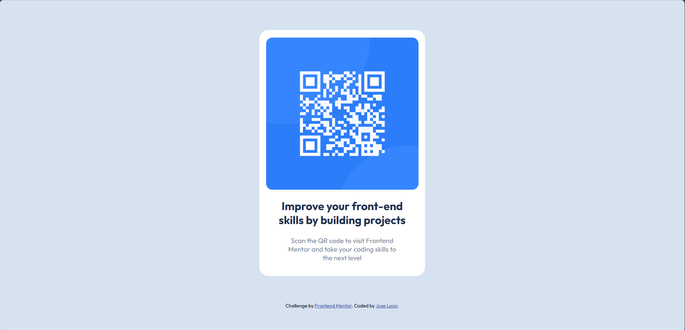

# Frontend Mentor - QR code component solution

This is a solution to the [QR code component challenge on Frontend Mentor](https://www.frontendmentor.io/challenges/qr-code-component-iux_sIO_H). Frontend Mentor challenges help you improve your coding skills by building realistic projects. 

## Table of contents

- [Overview](#overview)
  - [Screenshot](#screenshot)
  - [Links](#links)
- [My process](#my-process)
  - [Built with](#built-with)
  - [What I learned](#what-i-learned)
  - [Continued development](#continued-development)

## Overview

A recreated QR code component based on the designs provided by Frontend Mentor.

### Screenshot

### Links

- Solution URL: [https://github.com/jleonOCC/frontend-qrcomponent]

## My process

I always like to start off with bare text, images, styling, while mainting a general idea of the structure of the page with divs and such. Once I'm happy with that I move into CSS to begin the majority of the work for the replication process.

### Built with

- CSS custom properties
- Flexbox

### What I learned

Before doing this challenge I already had a thorough understanding of styling but I always find some hiccups here and there so this just helped to reinfornce some of that previous learnning.

### Continued development

After finishing this challenge, I realized I could've probably used custom properties to save the colors provided in the style-guide to make the style file more readable and easier to work with. Semantic HTML is always a plus and I could've defineitly utilized that too. Also, I've yet to learn how to make web pages responsive based on viewport sizes but this one turned out just fine thankfully.

